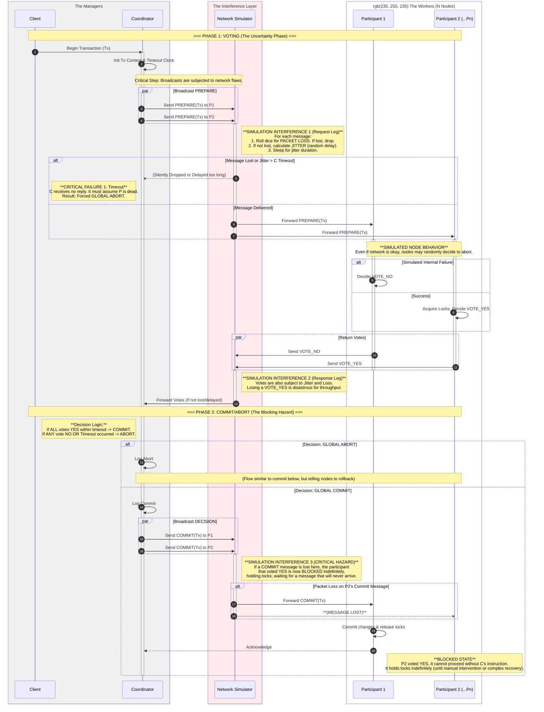

# Performance Analysis of a non strict Two-Phase Commit (2PC) in Varying Network Conditions

## Overview
This project implements a lightweight distributed transaction manager in Go to empirically measure the performance overhead and "blocking" behavior of the Two-Phase Commit (2PC) protocol. Unlike theoretical models that assume fixed delays, this simulation incorporates realistic network conditions such as variable latency, jitter, and packet loss.

## Project Goals
- **Empirical Measurement**: Quantify the impact of network latency and scale (number of participants) on transaction completion time.
- **Blocking Analysis**: Measure the duration participants spend in the critical "Ready" state where they are blocked waiting for the Coordinator.
- **Fault Tolerance Simulation**: Observe system behavior under failure scenarios (e.g., node aborts, message drops).

## Implementation Details

The system is designed as an in-memory simulation to run efficient experiments without the overhead of real network sockets or disk I/O, while maintaining architectural accuracy.

### 1. ArchitectureThe project is titled:
Performance Analysis of a non strict Two-Phase Commit (2PC) in Varying Network Conditions. The
paper identifies managing distributed transactions as critical for reliability and failure atomicity in
distributed database systems.
However, the authors note that full distributed transaction support (like 2PC) has seen slow or
incomplete commercial adoption because its performance overhead is poorly understood and
often a concern for vendors. Existing performance models often make simplistic assumptions,
such as fixed communication delays, which fail to capture the realities of scaling across different
network loads. This project aims to close this gap by creating a working prototype to empirically
measure the "blocking" overhead inherent in the 2PC protocol.
The core of this project will be to implement a lightweight distributed transaction manager. This
manager will consist of a single Coordinator node and multiple Participant nodes, implementing
the standard Two-Phase Commit logic: a "voting phase" where the coordinator queries
participants, and a "decision phase" where the final commit or abort command is broadcast. To
keep the project scope manageable within 20-30 hours, the implementation will focus on the
in-memory message exchange logic and state transitions (e.g., Ready, Abort, Commit) rather
than complex persistent disk recovery logs.
The simulation consists of three core components:

*   **Coordinator**: The central authority that initiates transactions. It executes the standard 2PC logic:
    *   *Phase 1*: Broadcasts `PREPARE` to all participants.
    *   *Phase 2*: Based on votes or timeout, broadcasts `COMMIT` or `ABORT`.
*   **Participant**: Distributed nodes that manage local transaction resources (simulated). They validate requests, vote `YES`/`NO`, and wait for the final decision.
*   **Network Transport**: A custom simulation layer that sits between nodes. It uses Go channels to deliver messages but injects delays and drops based on configuration.

### 2. Key Features
*   **State Machines**: Strict adherence to 2PC state transitions (Init -> Ready -> Committed/Aborted).
*   **Configurable Latency**: Network delays are modeled with an average latency and random jitter to mimic real-world variance.
*   **Reliable Transport Layer**:
    *   **Packet Loss Simulation**: Support for probabilistic message dropping.
    *   **Retry Logic**: The Coordinator implements a robust retry mechanism (default 500ms interval) to handle dropped packets during Phase 1 (Prepare) and Phase 2 (Decision).
    *   **Idempotency**: Participants are fully idempotent, handling duplicate messages correctly without incorrect state transitions.
*   **Fault Injection**:
    *   **Network Drops**: Control packet loss probability.
    *   **Random Aborts**: Participants can be configured to randomly vote `NO` to simulate local constraint violations.

### 3. Project Structure
```text
.
├── cmd
│   └── 2pc-sim        # Main entry point and CLI runner
├── pkg
│   ├── node           # Logic for Coordinator (with retries) and Participants (idempotent)
│   ├── protocol       # Definitions of 2PC messages (Prepare, Vote, etc.)
│   └── transport      # Network simulation (Channel-based with delay/jitter)
└── README.md
```

## Usage

Build the simulation binary:
```bash
go build -o 2pc-sim cmd/2pc-sim/main.go
```

### Running Experiments

The CLI supports several flags to vary the simulation parameters:

| Flag | Default | Description |
|------|---------|-------------|
| `--participants` | 3 | Number of Participant nodes |
| `--latency` | 10 | Average network one-way latency (ms) |
| `--drop-rate` | 0.0 | Probability of packet loss (0.0 - 1.0) |
| `--abort-rate` | 0.0 | Probability of a participant voting NO |
| `--timeout` | 5 | Transaction timeout (seconds) |
| `--jitter` | 0.2 | Network jitter factor (0.0 - 1.0), relative to latency |

### Scenarios

**1. Baseline Performance**
Measure standard overhead with low latency.
```bash
./2pc-sim --participants 5 --latency 5 --jitter 0.1
```

**2. High Latency / WAN Simulation**
Simulate a geo-distributed database across continents.
```bash
./2pc-sim --latency 150 --participants 3
```

**3. Robustness Under Network Failure (New)**
Demonstrate the retry mechanism recovering from packet loss.
```bash
# Even with 20% packet loss, the transaction should eventually Commit
./2pc-sim --drop-rate 0.2 --abort-rate 0.0 --participants 5
```

**4. High Abort Scenario**
Simulate critical constraint violations causing frequent aborts.
```bash
# Note: Any single "No" vote causes an immediate Abort logic, bypassing retries
./2pc-sim --abort-rate 0.5
```

**5. Testing**
```bash
# Run tests verbosely
go test -v ./pkg/**
``` 

### 6. Performance Analysis & Mathematical Models

The reliability and performance of Two-Phase Commit (2PC) are heavily dependent on network characteristics. Below is a mathematical breakdown of how simulation variables interact.

#### A. Variable Definitions
| Variable | Flag | Description |
|:---:|:---:|---|
| $N$ | `--participants` | Number of Participant nodes |
| $L$ | `--latency` | Average one-way network latency (ms) |
| $D$ | `--drop-rate` | Probability of packet loss ($0 \le D < 1$) |
| $A$ | `--abort-rate` | Probability of a node voting No ($0 \le A < 1$) |
| $R$ | `--retry-interval` | Time between retry attempts (ms) |
| $T$ | `--timeout` | Global transaction timeout (s) |

#### B. Probability of Global Commit
For a transaction to commit, **all** $N$ participants must vote Yes and **all** critical messages must eventually be delivered (potentially after retries).

The probability that **all** participants vote "Yes" (Logic Success) is:

$$ P(\text{Logic Success}) = (1 - A)^N $$

#### Derivation: The "All-or-Nothing" Rule
This formula comes from the core requirement of 2PC: **Every single participant must succeed.**
1.  **Independent Events**: If we assume each node fails independently with probability $A$.
2.  **The "AND" Logic**: Node 1 must say Yes **AND** Node 2 must say Yes **AND** ... Node $N$ must say Yes.
3.  **Calculation**:

$$ P(\text{Success}) = \underbrace{(1-A) \times (1-A) \times \dots \times (1-A)}_{N \text{ times}} = (1-A)^N $$

> **Visual Analogy:** Think of a long string of N Christmas lights in series. If even **one** bulb burns out ($VoteNo$), the entire string moves to darkness ($Abort$).

**Table: The Scalability Bottleneck**
Even a tiny failure rate becoming massive as $N$ grows ($A=0.001$ or 0.1%):
| Participants ($N$) | Single Node Success | **Global Success** $(1-A)^N$ | Global Abort Chance |
|:---:|:---:|:---:|:---:|
| 1 | 99.9% | **99.9%** | 0.1% |
| 10 | 99.9% | **99.0%** | 1.0% |
| 100 | 99.9% | **90.4%** | 9.6% |
| 1000 | 99.9% | **36.7%** | **63.3%** |

This effectively demonstrates why 2PC is considered "fragile" at scale.

#### C. Transaction Duration

**1. Best Case (No Drops)**
The minimum time is dominated by 4 message flights (Prepare -> Vote -> Commit -> Ack):

$$ T_{\text{min}} \approx 4 \times L $$

**2. Impact of Packet Drops**
When packet loss ($D$) exists, messages must be resent. The expected number of attempts ($E[\text{attempts}]$) for a single message success follows a geometric distribution:

$$ E[\text{attempts}] = \frac{1}{1-D} $$

If a message is dropped, the delay increases by $R$ (Retry Interval). Thus, the effective latency for a single step becomes:

$$ L_{\text{effective}} \approx L + \left(\frac{D}{1-D} \times R\right) $$

> **Warning:** If $R < 2L$, the Coordinator will "spam" retries before the first response can possibly arrive.
> **Requirement:** $T > L_{\text{effective}} \times 4$ to avoid timeout.

#### D. Failure Condition (Timeout)
The system will Abort due to Timeout if the total retries take too long:

$$ \text{Timeout Occurs if: } \quad (4 \times L) + (\text{Total Retries} \times R) > T $$

**Configuration Rule of Thumb:**
To guarantee robustness against up to $k$ consecutive drops:

$$ \text{Timeout} > (4 \times L) + (k \times R) $$

## Diagram

## Future Work
- **Persistence**: Add Write-Ahead Logging (WAL) to simulate disk I/O latency.
- **Recovery Protocol**: Implement the full recovery procedure for nodes coming back online after a crash.
- **3PC**: Implement Three-Phase Commit to compare blocking behavior.
